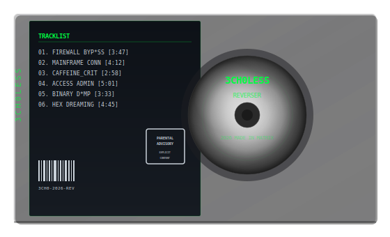

  

  
  

  
  
  

  <i>17 and i break things for fun. software, abandoned buildings, you name it. ai is my copilot because typing is hard. urbex enthusiast: if i'm not here, check the nearest condemned structure. professional silly goose and part-time nerd. i'm the hacker in the movies, green text on black screens, hacking the mainframe. don't take anything here too seriously, especially this bio.</i>

  

<h2>tools</h2>

<h3>reverse engineering</h3>

  
  

<h3>network analysis</h3>

  
  
  
  

<h3>platforms</h3>

  
  
  

  

  

